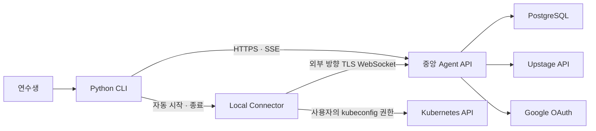
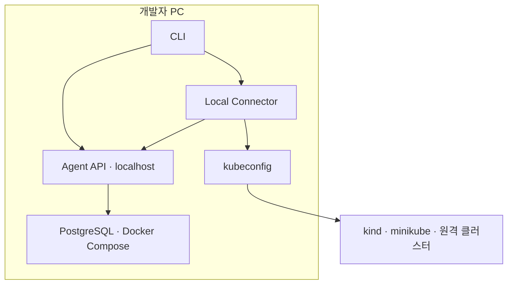
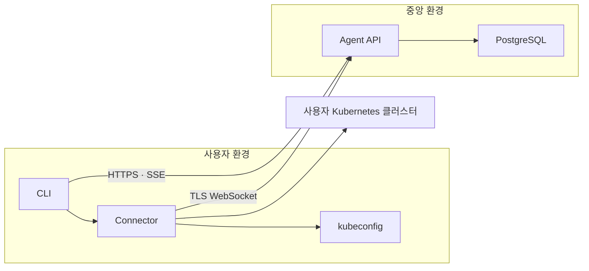

# Kukie Kubernetes Learning Agent 아키텍처

> 문서 상태: 설계 1 승인본 · 팀 논의용 초안<br>
> 작성일: 2026-07-27<br>
> 대상 브랜치: `docs/architecture`

## 1. 문서 목적

이 문서는 Kubernetes를 처음 사용하는 소프트웨어 마에스트로 연수생이 실제 클러스터를 안전하게 다루면서 학습할 수 있도록 돕는 LangGraph 기반 Agent의 시스템 경계와 주요 컴포넌트를 정의한다.

팀원이 동일한 구조와 책임 경계를 기준으로 개발 작업을 나누고, 구현 전에 보안·배포·사용자 경험에 관한 합의를 검토하는 것이 목적이다.

이 버전은 합의가 완료된 **설계 1: 시스템 아키텍처와 컴포넌트 경계**를 다룬다. LangGraph 내부 상태와 Subgraph, 상세 오류 처리, API 스키마, 테스트 시나리오의 최종 설계는 이 문서의 후속 논의 범위로 남긴다.

## 2. 제품 목표와 사용자

### 2.1 주요 사용자

- Kubernetes를 처음 배우는 소프트웨어 마에스트로 연수생
- 명령어를 복사하는 데 그치지 않고 리소스, 명령, 실행 결과의 의미를 이해하려는 사용자
- 로컬 클러스터부터 공용 교육 클러스터와 클라우드 관리형 클러스터까지 다양한 환경을 사용하는 사용자

### 2.2 MVP 목표

- 자연어 요청을 Kubernetes 작업으로 변환한다.
- 실행 전에 명령이나 매니페스트, 영향 범위와 위험을 설명한다.
- 리소스 상태, Events, Pod 로그와 Metrics API를 사용해 문제를 진단한다.
- 변경 작업은 사용자 승인 후 실행하고 결과를 다시 검증한다.
- 학습 설명을 켜면 개념과 이유를 자세히 설명하고, 끄면 실용적인 핵심 정보만 제공한다.
- 초심자용 대표 실습 시나리오를 안전하게 완료할 수 있는지를 MVP 완료 기준으로 삼는다.

### 2.3 MVP 제외 범위

- 단계별 커리큘럼, 과제 출제, 진도 및 평가 관리
- Prometheus, Loki 등 외부 관측 도구의 실제 연동
- 요청별 다중 LLM 자동 라우팅
- 조직, 멘토, 관리자 역할 기반의 팀 관리
- 다중 Agent가 서로 자율적으로 업무를 위임하는 구조

외부 관측 도구는 후속 플러그인으로 연결할 수 있도록 인터페이스 경계만 고려한다.

## 3. 확정된 아키텍처 원칙

1. 중앙 Agent API와 얇은 Python CLI를 분리한다.
2. Kubernetes 자격 증명과 실제 Tool 실행은 사용자 환경에 둔다.
3. 중앙 서버에는 kubeconfig나 Kubernetes 인증 토큰을 저장하지 않는다.
4. 중앙 Agent API는 Python 모듈러 모놀리스로 시작한다.
5. 사용자 한 명이 여러 Connector와 각 Connector의 여러 kubeconfig context를 사용할 수 있다.
6. CLI의 현재 context와 namespace를 작업 대상으로 사용하고, 세션 시작 시 사용자에게 명확하게 보여준다.
7. 세션 중 context나 namespace가 바뀌면 작업을 중단하고 새 대상을 다시 확인한다.
8. 조회 작업은 자동 실행할 수 있지만 변경 작업은 승인이 필요하다.
9. 고위험 작업은 영향과 대상을 재확인하는 이중 승인을 요구한다.
10. 대화와 실행 기록은 민감정보를 제거하거나 마스킹한 뒤 저장한다.
11. 기본 LLM은 Upstage를 사용하되 모델 제공자 인터페이스를 통해 교체할 수 있어야 한다.
12. 가입자 약 100명, 동시 사용자 20~30명을 초기 운영 기준으로 삼는다.

## 4. 시스템 컨텍스트



중앙이라는 표현은 논리적 책임을 뜻한다. 개발 단계에서는 Agent API, CLI, Connector와 PostgreSQL을 한 개발자 PC에서 함께 실행할 수 있다. 운영 단계에서 Agent API와 PostgreSQL만 원격 환경으로 이동하며 CLI와 Connector는 사용자 환경에 남는다.

## 5. 배포 구조

### 5.1 로컬 개발 모드



- Agent API와 Connector는 인터페이스 경계를 검증할 수 있도록 별도 프로세스로 실행한다.
- CLI는 `localhost`의 Agent API를 호출한다.
- PostgreSQL은 Docker Compose로 실행한다.
- Upstage 호출은 실제 API와 테스트용 모델 대역을 선택할 수 있다.
- Google OAuth 대신 로컬 개발에서만 허용되는 개발 사용자 인증 프로필을 제공한다.
- 로컬 개발 인증 프로필은 운영 설정에서 활성화할 수 없어야 한다.
- 실제 Kubernetes 통합 테스트에는 `kind`를 기본으로 사용한다.

### 5.2 운영 모드



Connector가 중앙으로 연결을 생성하므로 사용자 PC나 사설망에 인바운드 포트를 열지 않는다. MVP 중앙 API는 단일 인스턴스로 시작한다. 수평 확장이 실제로 필요해지는 시점에 Connector 라우팅과 작업 큐를 별도 인프라로 분리한다.

## 6. 주요 컴포넌트

### 6.1 Python CLI

#### 책임

- Google OAuth 로그인 시작 및 계정 세션 관리
- Agent API에 사용자 메시지 전송
- SSE 기반 응답과 진행 상태 출력
- 상세 학습 설명 ON/OFF 변경
- 현재 cluster, context와 namespace 표시
- 실행 계획, diff, 위험과 승인 요청 표시
- 일반 승인과 고위험 이중 승인 입력
- Local Connector 자동 시작, 상태 감시 및 종료

#### 사용자 경험

기본 사용 흐름은 다음 두 명령으로 제한한다.

```text
kukie login
kukie chat
```

`kukie chat`은 Connector 자식 프로세스를 자동으로 실행한다. 사용자는 Connector를 별도로 관리하지 않아도 된다. 세션을 정상 종료하면 진행 중인 요청을 취소하고 Connector도 종료한다.

### 6.2 Local Connector

Local Connector는 중앙 Agent API의 판단을 사용자 권한으로 Kubernetes API에 적용하는 **로컬 최소 권한 실행 계층**이다. LLM이나 독립 Agent가 아니다.

#### 존재 이유

- kubeconfig와 인증 토큰이 중앙 서버로 이동하지 않게 한다.
- `kind`, `minikube`, Docker Desktop과 같은 로컬 클러스터에 접근한다.
- VPN이나 사설망 내부 클러스터에 별도 인바운드 연결 없이 접근한다.
- 사용자의 실제 Kubernetes RBAC 범위를 그대로 적용한다.

#### 책임

- kubeconfig와 현재 context, namespace 읽기
- 세션 시작 시 대상 cluster, context, namespace와 권한 요약 전달
- 세션 중 context 또는 namespace 변경 감지
- 구조화된 Kubernetes Tool 요청 검증 및 실행
- 요청 타임아웃, 취소와 반환 데이터 크기 제한
- Secret, 토큰과 기타 민감 값 제거 또는 마스킹
- 중앙 Agent API와 heartbeat 유지
- 승인된 변경 계획과 실제 요청의 일치 여부 확인
- 실행 결과와 감사용 메타데이터 반환

#### 비책임

- 사용자 질문 이해와 의도 분류
- LLM 호출과 프롬프트 관리
- 장애 원인 추론
- 실행 계획과 학습 설명 생성
- 대화 기록 장기 보관

#### Tool 설계 원칙

Connector에는 임의 셸 명령 실행 인터페이스를 제공하지 않는다. 입력과 출력 스키마가 정의된 Tool만 허용한다.

초기 Tool 범주는 다음과 같다.

- 리소스 목록 및 단건 조회
- 리소스 상세 상태 조회
- Events 조회
- Pod 로그 조회
- Metrics API 조회
- 매니페스트 dry-run 및 diff
- 매니페스트 적용
- 리소스 patch 및 삭제
- Deployment rollout restart 및 undo

정확한 Tool 이름과 요청·응답 스키마는 후속 API 설계에서 확정한다.

### 6.3 중앙 Agent API

중앙 Agent API는 하나의 배포 단위를 유지하되 내부를 다음 모듈로 나눈다.

| 모듈 | 책임 |
|---|---|
| API Boundary | Google OAuth, REST API, SSE 스트리밍, 요청 검증 |
| Session Service | 사용자 설정, 세션, 현재 대상 snapshot과 대화 이력 관리 |
| Connector Gateway | 일회용 페어링, Connector 연결 상태, Tool 요청·응답 중계 |
| LangGraph Runtime | 요청 라우팅, Subgraph 실행, Agent 상태와 체크포인트 관리 |
| Safety Kernel | 위험도 분류, 승인 상태, 계획 무결성, 감사 이벤트 생성 |
| Model Adapter | Upstage 호출과 모델 제공자 교체 경계 |
| Redaction Layer | 중앙 저장 전 민감정보 탐지, 제거와 마스킹 |

모듈은 Python 패키지 경계와 명시적인 입출력 모델로 분리한다. MVP에서는 모듈마다 별도 네트워크 서비스를 만들지 않는다.

### 6.4 PostgreSQL

PostgreSQL은 다음 데이터를 저장한다.

- 사용자와 Google OAuth 계정 연결 정보
- 계정별 상세 학습 설명 기본값
- Connector 식별자, 공개 메타데이터와 페어링 상태
- 대화 세션과 메시지
- LangGraph 체크포인트
- 실행 계획, 승인과 실행 결과
- 마스킹된 감사 기록

kubeconfig, Kubernetes 인증 토큰, Secret 원문과 필터링 전 로그는 저장하지 않는다.

### 6.5 Model Adapter

- Upstage를 MVP 기본 제공자로 사용한다.
- Agent 핵심 로직은 특정 모델명이나 제공자 SDK에 직접 의존하지 않는다.
- 설정으로 모델과 생성 파라미터를 교체할 수 있도록 표준화된 채팅 모델 인터페이스를 제공한다.
- 요청별 자동 모델 선택과 복잡한 비용 라우팅은 MVP에서 구현하지 않는다.

## 7. 통신 경계

| 구간 | 방식 | 주요 용도 |
|---|---|---|
| CLI → Agent API | HTTPS REST | 로그인 결과, 세션, 메시지, 모드 변경, 승인 |
| Agent API → CLI | SSE | 답변 토큰, 진행 단계, Tool 상태, 승인 요청 |
| Connector → Agent API | 외부 방향 TLS WebSocket | 페어링 이후 연결 유지, Tool 요청·응답, heartbeat |
| Connector → Kubernetes | Kubernetes API | kubeconfig 기반 조회 및 변경 |
| Agent API → Upstage | HTTPS | 모델 추론 |
| Agent API → PostgreSQL | 암호화된 DB 연결 | 사용자, 세션, 체크포인트, 감사 데이터 |

API 메시지에는 최소한 `request_id`, `session_id`, `connector_id`, `target_snapshot`, `timeout`, `schema_version`을 포함해 추적성과 호환성을 확보한다.

## 8. 세션과 대상 클러스터

1. `kukie chat`이 Local Connector를 시작한다.
2. Connector가 현재 kubeconfig context와 namespace를 읽는다.
3. CLI가 사용자에게 다음 정보를 보여준다.
   - Connector 이름
   - 현재 context와 cluster endpoint
   - namespace
   - 사용자 및 RBAC 권한 요약
   - 운영 환경으로 추정될 경우 경고
4. 사용자가 대상을 확인하면 세션을 시작한다.
5. 각 Tool 호출 전에 Connector가 현재 대상과 세션 시작 snapshot을 비교한다.
6. context나 namespace가 달라졌으면 요청을 실행하지 않고 재확인을 요구한다.

Agent가 대화 내용만으로 cluster나 namespace를 자동 선택하지 않도록 한다.

## 9. 인증과 Connector 페어링

- 인증 제공자는 교체 가능한 인터페이스로 분리한다.
- MVP 로그인 제공자는 Google OAuth이다.
- 로그인한 사용자가 일회용 페어링 코드를 발급한다.
- Connector는 코드를 한 번만 사용해 자신의 장치 키와 사용자 계정을 연결한다.
- 페어링 후 Connector는 중앙 Agent API로 외부 방향 연결을 생성한다.
- 장기 장치 비밀 값은 OS keyring에 저장하고 서버에는 검증 가능한 형태만 보관한다.
- 사용자는 여러 Connector를 등록할 수 있으며 개별 연결을 폐기할 수 있다.

## 10. 실행 안전성

### 10.1 조회 작업

리소스 상태, Events, 로그와 metrics 등 읽기 전용 작업은 사용자 추가 승인 없이 실행할 수 있다. 단, Secret 원문과 인증 데이터처럼 민감도가 높은 조회는 Tool 정책에서 차단하거나 별도의 안전 처리를 적용한다.

### 10.2 변경 작업

- Agent가 실행 계획, 대상, diff, 영향, 위험과 검증 방법을 먼저 제시한다.
- 일반 변경은 사용자가 계획을 승인한 뒤 실행한다.
- 삭제, cluster-scoped 리소스와 대규모 영향 가능성이 있는 작업은 대상을 다시 확인하는 이중 승인을 요구한다.
- 승인은 계획 ID와 계획 내용의 해시에 결합한다.
- 승인 후 명령, 대상 또는 파라미터가 달라지면 승인을 무효화한다.
- Connector는 유효한 승인 증명이 없는 변경 요청을 거부한다.
- Connector의 실행 권한은 사용자의 Kubernetes RBAC 권한을 초과할 수 없다.

## 11. 데이터 보호와 감사

- 대화, 실행 명령, 승인, 결과 요약은 학습 복습과 감사 목적으로 저장한다.
- 중앙 저장 전에 Secret, 토큰, kubeconfig, 인증 헤더와 로그 내 민감정보를 제거하거나 마스킹한다.
- 원문 Tool 응답은 필요한 최소 시간 동안 메모리에서만 처리하고 기본적으로 영구 저장하지 않는다.
- 모든 변경에는 사용자, 시각, 대상 snapshot, 계획 해시, 승인 단계와 실행 결과를 연결한다.
- 민감정보 필터가 실패하면 원문 저장보다 기록 누락을 선택한다.

구체적인 보존 기간과 사용자 삭제 정책은 운영 정책 문서에서 별도로 확정한다.

## 12. 상세 학습 설명 모드

사용자는 계정 기본값을 저장하고 현재 세션에서 즉시 ON/OFF할 수 있다.

| 설정 | 응답 방식 |
|---|---|
| ON | 개념, 선택 이유, 명령·YAML 구조, 실행 결과 해석과 추가 학습 포인트 제공 |
| OFF | 필요한 명령, 핵심 근거, 주의사항과 실행 결과만 간결하게 제공 |

모드 설정은 설명의 깊이에만 영향을 준다. 안전 경고, 위험도 평가와 승인 절차는 항상 동일하게 적용한다.

## 13. 팀 개발 경계

컴포넌트 간 스키마를 먼저 합의하면 다음 영역을 병렬로 개발할 수 있다.

| 작업 영역 | 주요 산출물 | 주요 의존 인터페이스 |
|---|---|---|
| CLI | 명령 체계, OAuth 흐름, SSE 출력, 승인 UX, Connector 생명주기 | Agent REST/SSE, Connector 프로세스 계약 |
| Connector | 페어링, WebSocket, kubeconfig, Kubernetes Tool, redaction | Connector protocol, Tool schema |
| Agent API | FastAPI 경계, 사용자·세션 서비스, 스트리밍 | 인증·세션·Graph 입출력 모델 |
| LangGraph | Router, Subgraph, 상태와 checkpoint | Tool schema, Safety Kernel |
| Safety | 위험 분류, 계획 해시, 승인 검증, 감사 이벤트 | Change Plan, Connector protocol |
| Data/Auth | PostgreSQL 모델, Google OAuth, 장치 페어링 | 사용자·세션·Connector 모델 |
| Evaluation | kind 기반 대표 실습과 장애 진단 시나리오 | CLI/API 계약, Tool 대역 |

병렬 개발을 시작하기 전에 공통 Pydantic 모델, 오류 코드, 이벤트 envelope와 버전 정책을 먼저 확정한다.

## 14. 설계 1 승인 기준

다음 조건이 팀 합의되면 시스템 아키텍처와 컴포넌트 경계를 승인한 것으로 본다.

- 중앙 Agent API와 Local Connector의 역할 구분이 명확하다.
- kubeconfig를 중앙에 저장하지 않는 원칙에 동의한다.
- CLI가 Connector를 자동으로 관리하는 사용자 경험에 동의한다.
- Python 모듈러 모놀리스와 PostgreSQL 기반 MVP에 동의한다.
- HTTPS/SSE 및 외부 방향 TLS WebSocket 통신 경계에 동의한다.
- 변경 승인과 고위험 이중 승인 원칙에 동의한다.
- 제안된 팀 개발 경계가 실제 담당자 분배에 사용할 수 있다.

## 15. 후속 설계 범위

이 문서의 다음 논의에서 아래 항목을 구체화한다.

1. LangGraph 공유 상태와 Subgraph 입출력 계약
2. 제한된 진단 Agent 루프의 종료 조건과 예산
3. 실행 계획 및 승인 상태 머신
4. REST, SSE, WebSocket과 Tool 상세 스키마
5. 오류 분류, 재시도, 취소와 장애 복구
6. 데이터 모델, 보존 기간과 삭제 정책
7. 관측 가능성, LLM 평가와 대표 실습 시나리오
8. 단계별 구현 순서와 담당자 배분

## 16. 참고 자료

- [LangGraph Subgraphs](https://docs.langchain.com/oss/python/langgraph/use-subgraphs)
- [LangGraph Interrupts](https://docs.langchain.com/oss/python/langgraph/interrupts)
- [LangGraph Persistence](https://docs.langchain.com/oss/python/langgraph/persistence)
- [Kubernetes 공식 Client Libraries](https://kubernetes.io/docs/reference/using-api/client-libraries/)
- [LangChain Upstage 통합](https://github.com/langchain-ai/langchain-upstage)
- [Upstage API Console](https://console.upstage.ai/)
