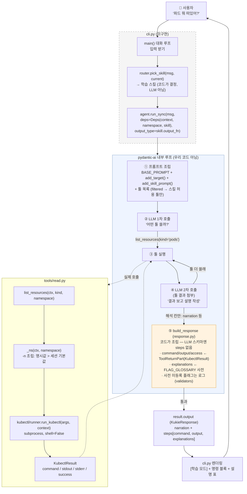
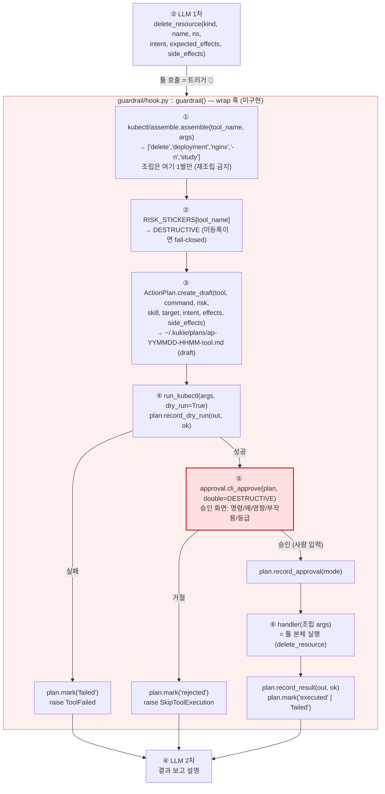
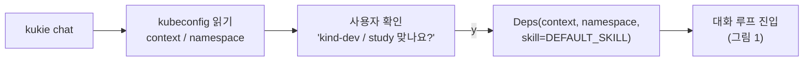

# Kukie 에이전트 호출 흐름 (함수 단위)

> 기준: 가드레일 v2 코드 + PR #18/#19 (2026-08-18). "파드 뭐 떠있어?" 한 문장이 처리되는 전 과정.
> 범례: 실선 = 우리 코드 / 점선 = pydantic-ai 내부(우리가 안 짬) / 회색 = 미구현

## 1. 전체 흐름 (읽기 요청)

## 2. 변경 요청일 때 — ③에 훅이 끼어듦

훅 안에서 LLM 호출: **0번.** LLM은 훅 전(툴 호출)과 후(결과 설명)에만 등장.

## 3. 세션 시작 (cli.py, 미구현)

## 4. 함수 → 파일 매핑

| 단계 | 함수 | 파일 | 상태 |
|---|---|---|---|
| 세션·루프·렌더 | `main()` | `cli.py` | ❌ |
| 스킬 결정 | `pick_skill()` | `router.py` | ✅ (/mode + sticky) |
| 에이전트 설정 | `Agent(...)`, `add_target()`, `add_skill_prompt()` | `agent.py` | ✅ |
| 툴 등록 | `FunctionToolset(READ_TOOLS).filtered(...)` | `agent.py` | ✅ PR #19 (읽기 5종만) |
| 읽기 툴 5종 | `list_resources` 등 | `tools/read.py` | ✅ |
| 변경 툴 4종 | `delete_resource` 등 | `tools/mutate.py` | ❌ (훅 이후) |
| 명령 조립 | `assemble()` | `kubectl/assemble.py` | 부분 (apply TODO) |
| 실행 | `run_kubectl()` | `kubectl/runner.py` | ✅ |
| 훅 파이프라인 | `guardrail()` | `guardrail/hook.py` | ❌ (팀원) |
| Action Plan | `create_draft()`, `record_*()`, `mark()` | `guardrail/action_plan.py` | ✅ PR #18 머지 |
| 승인 | `cli_approve()` | `guardrail/approval.py` | ❌ (앱 전환 시 ApprovalRequired 재설계) |
| 응답 조립 (steps·설명) | `build_response_for()`, `collect_steps()` + `FLAG_GLOSSARY` | `response.py`, `glossary.py` | ✅ DURO-44 |
| 사전 미등록 플래그 로그 | `log_unregistered_flags()` | `validators.py` | ✅ DURO-44 |
| LLM 왕복 루프 | — | pydantic-ai 내부 | (우리 코드 아님) |

## 5. 누가 뭘 결정하나

| 결정 | 주체 | 시점 |
|---|---|---|
| 어떤 스킬 | 코드 (`router`) / 사용자 (`/mode`, 전환 y) | run 전 |
| 어떤 툴, 어떤 값, intent | LLM | ② (1차 호출) |
| kubectl 명령 문장 | 코드 (`assemble` / 툴 내부) | ③ |
| 위험도 | 코드 (`RISK_STICKERS`) | 훅 ② |
| 실행 여부 | 사람 (승인 화면) | 훅 ⑤ |
| 명령·결과 (steps 사실 칸) | 코드 (`collect_steps` — 실행 기록 그대로) | ⑤ |
| 설명 (explanations) | 코드 (`FLAG_GLOSSARY` 사전) | ⑤ |
| 해석 (narration, 전환 제안) | LLM | ④ (2차 호출) |
